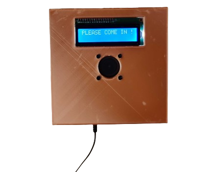
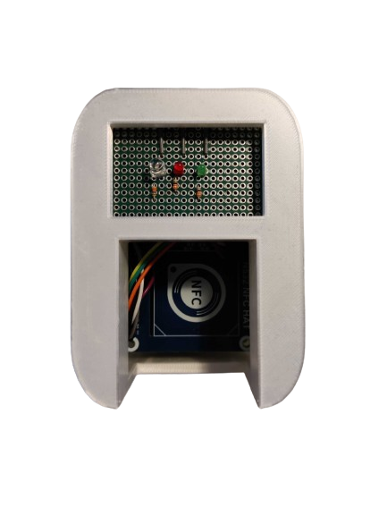
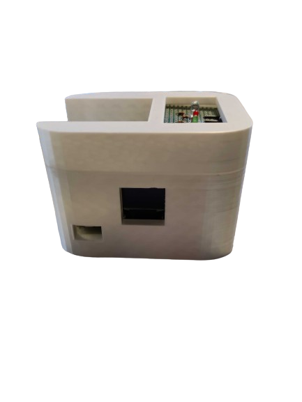

# Raspberry Pi NFC Reader and availability sign

NFC Reader with LCD Display API receiver. 

## Overview

## Resources

## LCD sign

### 3D prints

### Assembly and wiring

### Software

## NFC reader

### 3D prints

### Assembly and wiring

### Software

## Future improvements
- Use magnets rather than super glue for the cases
- Improve the sign of the LCD panel space in the NFC reader
- Create a cover for the LED lights
- Reduce the size of the LCD sign
- Fix the size of the LCD holder on the LCD sign